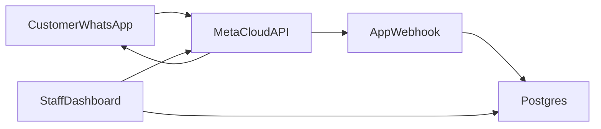
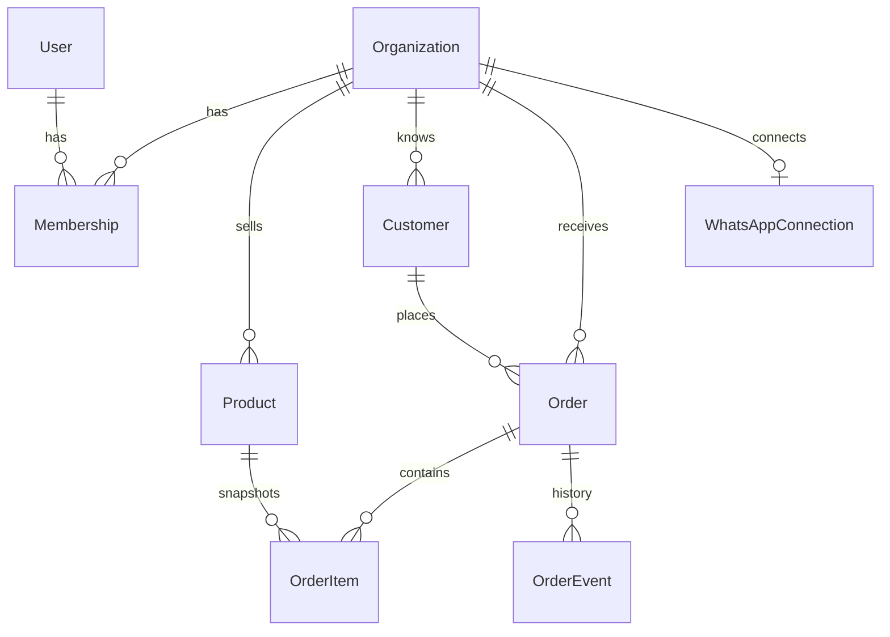

# WhatsApp Order Manager — Project Plan

Permanent planning reference for product scope, architecture, and phased delivery. Implementation has not started; this document captures the approved technical decisions and assumptions.

---

## 1. Project overview

**WhatsApp Order Manager** is a multi-tenant SaaS product for small businesses to receive, manage, and fulfill orders through WhatsApp. Shops get one dashboard for catalog, orders, and customer status messages—without spreadsheets or a shared phone.

The application will be built on the existing Next.js App Router + Tailwind stack, adding PostgreSQL, Prisma, Auth.js, Zod, and shadcn/ui. The Meta WhatsApp Cloud API is the only supported messaging channel.

---

## 2. Current project state

**Already present (vanilla `create-next-app` only):**

- Next.js **16.3.6** App Router, React **19.2.8**, TypeScript (strict), Tailwind CSS **v4**
- Scripts: `dev`, `build`, `start`, `lint` — no test, database, or auth scripts
- Source: `app/page.tsx` (default Next.js landing), `app/layout.tsx` (Geist fonts, generic metadata), `app/globals.css`
- Config: `next.config.ts` (empty), `tsconfig.json` (`@/*` → repo root), `eslint.config.mjs`, `postcss.config.mjs`, `.gitignore` (already ignores `.env*`)
- `README.md` is the default Next.js getting-started text
- Path alias `@/*` already points at the project root (no `src/` folder)

**Not present yet (entire product):**

- Auth, database, Prisma, API routes, webhooks, tenants, orders, catalog, WhatsApp, billing, tests, docs beyond this plan, UI kit (shadcn), env examples, middleware

**Stack decision:** Keep the current App Router + Tailwind stack. Do not rewrite the framework. Replace the starter homepage; do not keep `create-next-app` copy in production routes.

---

## 3. Product goal and problem

**Goal:** Give small shops (food, grocery, pharmacies, local retail) one dashboard to take WhatsApp orders, keep a catalog, and notify customers.

**Problem:** Orders arrive as unstructured chats. Staff lose messages, prices are inconsistent, and customers get no status updates. WhatsApp is where customers already are; the product turns that channel into an operational system.

**MVP success:** A shop can connect a WhatsApp Business number, publish a small catalog, receive an order in the dashboard, move it through statuses, and send the customer a confirmation/status message.

---

## 4. Target users

- **Primary:** Owner-operators of local businesses using WhatsApp as their storefront (1–20 staff).
- **Secondary:** Shop managers and order-desk staff.
- **Internal (later):** Platform super-admin for tenant support and abuse control.

**Not in MVP:** Large enterprise WABA agencies, marketplace multi-seller, or a consumer-facing shopping app (customers stay on WhatsApp).

---

## 5. MVP scope

**In scope:**

- Email/password signup, login, logout, session
- Organization (tenant) created on signup; invite one extra user later if time allows — **minimum:** owner-only is acceptable for first cut; **invite staff** if it fits the same phase
- Catalog: products with name, price, optional description, SKU, active/inactive
- Incoming WhatsApp messages parsed into orders (structured catalog reply **or** staff-assisted capture of free-text as a manual order)
- Orders list + detail: customer phone, items, totals, notes, timestamps
- Order statuses: `NEW` → `CONFIRMED` → `PREPARING` → `READY` → `COMPLETED` | `CANCELLED`
- Outbound WhatsApp: order received + status-change messages (Cloud API; templates for out-of-session)
- WhatsApp Cloud API webhook: verify, receive, map phone-number-id → tenant, idempotent ingest
- Tenant settings: store name, currency, WhatsApp connection (phone number id, WABA id, token stored encrypted)
- Basic dashboard: today’s orders, counts by status
- Input validation (Zod), tenant isolation, rate limits on webhook and auth

**Explicitly out of MVP:** Payments, subscriptions UI, inventory, delivery GPS, AI parsing, multi-language bot, broadcast campaigns.

---

## 6. Future / Phase 2 features

- Stripe billing, plans, usage limits (orders/month, staff seats)
- Staff invites, roles beyond owner/staff
- Catalog categories, variants, images, availability windows
- Interactive WhatsApp catalog / list messages / order buttons
- Payment links (Stripe / local wallets) sent in chat
- Delivery vs pickup, riders, estimated time
- Automated keyword bot + optional LLM extraction of free-text orders
- Analytics, CSV export, printer-friendly kitchen ticket
- Multiple WhatsApp numbers per tenant
- Platform admin console, audit log UI, GDPR export/delete tools
- WhatsApp Flows / official catalog commerce if Meta eligibility allows

---

## 7. User roles and permissions

| Role | Scope | MVP |
| --- | --- | --- |
| Owner | Full tenant: catalog, orders, WhatsApp settings, billing (later), members | Yes |
| Staff | Orders + catalog view/edit; no WhatsApp tokens, no billing, no member admin | Yes (or owner-only first) |
| PlatformAdmin | Cross-tenant support, disable tenants | Phase 2 |

**Rules:**

- Every query is scoped by `organizationId`.
- Staff cannot read other tenants.
- Webhook workers run as system with tenant resolved from Meta `phone_number_id`, not from a user session.

---

## 8. Main user flows



1. **Onboarding:** Sign up → create Organization → copy webhook URL + verify token → paste Cloud API token / phone number id → send test message.
2. **Catalog:** Owner adds products → marks active.
3. **Customer order (happy path):** Customer messages shop → bot sends catalog or “reply with items” → order created `NEW` → dashboard notification → staff `CONFIRMED` → preparing → ready → completed; customer gets WhatsApp updates.
4. **Manual order:** Staff creates order from a chat that could not be parsed.
5. **Cancel:** Staff cancels with reason; customer notified when a 24h session or template allows.

---

## 9. Frontend / page structure

**Public**

- `/` — marketing (replace starter page)
- `/login`, `/signup`
- `/privacy`, `/terms` (stubs OK in MVP)

**App (auth + tenant)**

- `/app` — dashboard
- `/app/orders`, `/app/orders/[id]`
- `/app/catalog`, `/app/catalog/new`, `/app/catalog/[id]`
- `/app/settings` — store profile
- `/app/settings/whatsapp` — connection status, webhook docs, test send
- `/app/settings/team` — members (MVP or early Phase 2)

**UI:** shadcn/ui on Tailwind 4, sidebar layout in `app/app/layout.tsx` (or `app/(dashboard)/`). Server Components for lists; client components for tables/filters/status actions. Loading/error boundaries per route segment.

---

## 10. Backend / API architecture

Stay in **one Next.js app** (no separate Nest server for MVP).

- **Route Handlers** under `app/api/...` for webhooks and JSON APIs
- **Server Actions** for dashboard mutations (create product, change order status) with Zod + authz
- **Domain modules** in `lib/` (orders, catalog, whatsapp, auth, tenants) — handlers stay thin
- **Webhook:** `POST /api/webhooks/whatsapp` — signature verification, respond 200 quickly, process ingest synchronously at first (queue later if latency/retries need it)
- **Jobs (Phase 2):** outbound message retry queue (Inngest or similar)

**Suggested API surface:**

- `POST /api/webhooks/whatsapp` — Meta
- `GET /api/health` — uptime
- Dashboard data via RSC + actions; optional `GET /api/orders` only if the UI needs client fetch

---

## 11. Database entities and relationships

**PostgreSQL + Prisma.** Shared schema, `organizationId` on every tenant row. UUIDs. Soft-delete products; never delete orders (cancel instead).



**Entities:**

- **User:** email, passwordHash, name
- **Organization:** name, slug, currency, timezone, plan (default `free`)
- **Membership:** userId, organizationId, role (`OWNER` | `STAFF`)
- **WhatsAppConnection:** wabaId, phoneNumberId, encrypted access token, webhook verify token, status
- **Product:** name, description, priceMinor (integer), currency, sku, isActive
- **Customer:** waId (phone), displayName, lastMessageAt
- **Order:** status, source (`WHATSAPP` | `MANUAL`), customerId, notes, totals, externalMessageId (idempotency)
- **OrderItem:** nameSnapshot, unitPriceMinor, qty, productId nullable
- **OrderEvent:** fromStatus, toStatus, actorUserId nullable, meta JSON
- **ProcessedWebhook:** Meta `wamid` / message id unique — prevent duplicate orders

**Indexes:**

- `(organizationId, status, createdAt)` on Order
- Unique `(organizationId, waId)` on Customer
- Unique `phoneNumberId` on WhatsAppConnection

---

## 12. Authentication and authorization

- **Auth.js (NextAuth v5)** with Credentials (email/password, hashed with Argon2 or bcrypt) and JWT or database sessions (**database sessions preferred** for revocation)
- Protected `/app/**` via `proxy.ts` / middleware + server-side `auth()` on layouts
- Authorization helper `requireMembership(orgId, roles[])` on every action
- CSRF: Server Actions default; webhook uses Meta signature, not cookies
- Phase 2: Google OAuth, magic link, password reset email (Resend)

---

## 13. Multi-tenant SaaS architecture

- **Tenant = Organization.** One active org per session in MVP (`memberships[0]` or `lastUsedOrganizationId`)
- **Isolation:** Prisma queries always include `organizationId` from session; never trust client-supplied org id without membership check
- **WhatsApp tenancy:** inbound `phone_number_id` → `WhatsAppConnection.organizationId`
- **No schema-per-tenant** until a customer requires it (operational cost too high for MVP)
- **Billing later:** `Organization.plan`, Stripe `customerId`; feature flags in `lib/billing/entitlements.ts`

---

## 14. WhatsApp integration approach

**Use official Meta WhatsApp Cloud API only** (not whatsapp-web.js / unofficial clients — those are against ToS and cannot be sold as SaaS).

**MVP approach:**

1. Tenant uses their own Meta Business / test number (or a documented test WABA)
2. App stores per-tenant token (encrypted at rest with `ENCRYPTION_KEY`)
3. Webhook verifies `hub.challenge` and `X-Hub-Signature-256`
4. Inbound: text + interactive replies; create/update Customer; create Order when payload matches a simple protocol (e.g. numbered catalog reply or `ORDER:` format)
5. Outbound: session messages within 24h; **message templates** for status after the window
6. Idempotency on `messages[].id`

**Phase 2:** Official catalog, buttons/lists, media (voice notes as attachments, not auto-transcribed until later).

**Assumption:** MVP bot is **rules-based**, not LLM. Free-text that does not match is stored as a conversation note / `NEW` order with `needsReview`.

---

## 15. Order lifecycle

Allowed transitions (enforce in `lib/orders/transition.ts`):

- `NEW` → `CONFIRMED` | `CANCELLED`
- `CONFIRMED` → `PREPARING` | `CANCELLED`
- `PREPARING` → `READY` | `CANCELLED`
- `READY` → `COMPLETED` | `CANCELLED`
- `COMPLETED` and `CANCELLED` are terminal

Each transition writes `OrderEvent` and attempts WhatsApp notify. Failed notify is logged; order still updates (staff can retry send).

---

## 16. Security and validation

- Zod on all actions, query params, and webhook bodies
- Encrypt WhatsApp tokens; never return them to the client after save (mask)
- Secrets only in env; no tokens in git
- Webhook signature + unique message ids
- Rate limit login and webhook (IP + phone)
- Parameterized Prisma only (no raw SQL with string concat)
- Helmet-equivalent headers in `next.config.ts`; HTTPS in production
- PII: phone numbers are customer identifiers — restrict logs; do not log full tokens or message bodies in production
- File uploads (Phase 2 images): type/size checks, private storage

---

## 17. Error handling

- Typed `AppError` (validation 400, auth 401, forbidden 403, not found 404, conflict 409, WhatsApp upstream 502)
- `app/error.tsx`, `not-found.tsx`, dashboard `error.tsx`
- API: JSON `{ error: { code, message } }` — no stack traces to client
- Webhook: always 200 after signature OK if the event is persisted; retry-safe ingest; 4xx only for bad signature
- User-facing toasts for action failures; persistent “WhatsApp disconnected” banner

---

## 18. Testing strategy

- **Unit:** status transitions, catalog pricing totals, webhook idempotency, tenant scoping helpers (Vitest)
- **Integration:** Prisma against test Postgres (or testcontainers) for order create + membership
- **API:** webhook verify + duplicate message id
- **E2E (Playwright):** signup → add product → mock WhatsApp payload → see order → change status (Phase 1 late)
- **CI:** `lint`, `typecheck`, `test`, `build`
- No unofficial WhatsApp live tests in CI; use recorded Meta payloads as fixtures

---

## 19. Environment variables

Document in `.env.example` when implementation starts:

| Variable | Purpose |
| --- | --- |
| `DATABASE_URL` | PostgreSQL connection string |
| `AUTH_SECRET` | Auth.js secret |
| `ENCRYPTION_KEY` | Encrypt per-tenant WhatsApp tokens at rest |
| `WHATSAPP_APP_SECRET` | Meta app secret for webhook signature verification |
| `NEXT_PUBLIC_APP_URL` | Public app URL (webhooks, links) |

**Optional later:** `STRIPE_*`, `RESEND_API_KEY`, `REDIS_URL`

Per-tenant Cloud tokens live in the database, not in global env. Global env holds **platform** Meta app credentials only.

---

## 20. Recommended project structure

Keep App Router at repo root (matches current project):

```text
app/                    # routes, layouts, api/webhooks/whatsapp/route.ts
components/
  ui/                   # shadcn
  orders/
  catalog/
lib/
  auth/
  db/                   # Prisma client
  orders/
  catalog/
  whatsapp/
  tenancy/
  validation/
prisma/
  schema.prisma
  migrations/
tests/
  unit/
  integration/
e2e/
docs/                   # planning and operational docs
types/                  # shared DTOs if needed
```

---

## 21. Documentation structure

| Document | Purpose |
| --- | --- |
| `README.md` | Product overview, local setup, scripts (keep existing until rewritten during implementation) |
| `docs/PROJECT_PLAN.md` | This permanent planning reference |
| `docs/product.md` | Goal, MVP vs Phase 2 |
| `docs/architecture.md` | Tenancy, auth, WhatsApp |
| `docs/domain.md` | Order lifecycle, entities |
| `docs/api.md` | Webhook + actions |
| `docs/security.md` | Secrets, PII, validation |
| `docs/local-development.md` | Postgres, env, Meta test numbers |
| `docs/deployment.md` | Vercel + managed Postgres assumptions |

Additional docs (`product.md`, `architecture.md`, etc.) are created when implementation starts.

---

## 22. Phased implementation roadmap

**Phase 0 — Foundation**  
Deps (Prisma, Auth.js, Zod, shadcn), Postgres schema, env example, replace starter UI shell, docs skeleton, CI lint/typecheck.

**Phase 1 — Auth and tenancy**  
Signup/login, Organization + Membership, `/app` guard, owner session.

**Phase 2 — Catalog and orders (no WhatsApp yet)**  
CRUD products, manual orders, status machine, dashboard lists.

**Phase 3 — WhatsApp MVP**  
Connection settings, webhook, inbound idempotency, outbound confirm/status, encryption.

**Phase 4 — Hardening**  
Tests, rate limits, error UX, README rewrite, production headers.

**Phase 5 — Future product**  
Billing, invites, bot UX, analytics, platform admin.

**Current status:** Planning documentation only. Application feature implementation has not started. Recommended first implementation slice after approval to build: **Phase 0 + Phase 1**.
